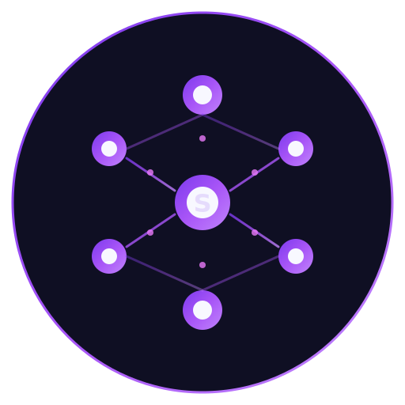

# 🧠 Synapse

A thin, powerful state management library for React with saga-like effects and API integration.

<p align="center">
  
</p>

## 🚀 Quick Start

### Run the Demo

```bash
# Install dependencies
npm install

# Start the demo app
npm run dev
```

Open [http://localhost:5173](http://localhost:5173) to see the interactive demo!

### What You'll See

- **Counter Demo** - Basic state management, async actions, multi-action dispatch, waitFor
- **User List** - API integration with `useQuery` hook and `createApiAction`
- **Todo App** - Full CRUD operations with filtering and persistence
- **API Examples** - `useQuery`, `useLazyQuery`, `useMutation`, direct API actions

## Features

- 🪶 **Lightweight** - Thin Redux-like API without the boilerplate
- ⚡ **React 16.8+** - Works with all React versions (16.8+, 17, 18, 19)
- 🔄 **Middleware** - Logger, thunk, API, and custom middleware support
- 🎣 **Hooks** - `useSelector`, `useDispatch`, `useQuery`, `useMutation`, `useLazyQuery`
- 🌐 **API Integration** - Built-in Axios integration with `{ isLoading, error, data, headers }`
- 🛠️ **CLI** - Generate slices, stores, and boilerplate with one command
- 📝 **Config File** - `synapse.config.json` for customization
- 🔧 **DevTools** - Chrome extension for debugging (included)
- 📦 **TypeScript** - Full TypeScript support

## Installation

```bash
npm install synapse-state
# or
yarn add synapse-state
# or
pnpm add synapse-state
```

## Quick Start

### 1. Create a Slice

```typescript
// src/store/slices/counter/counter.slice.ts
import { createSlice } from 'synapse-state';

interface CounterState {
  value: number;
}

const initialState: CounterState = {
  value: 0,
};

export const counterSlice = createSlice({
  name: 'counter',
  initialState,
  reducers: {
    increment: (state) => {
      state.value += 1;
    },
    decrement: (state) => {
      state.value -= 1;
    },
    incrementByAmount: (state, action) => {
      state.value += action.payload;
    },
  },
});

export const { increment, decrement, incrementByAmount } = counterSlice.actions;
export const counterReducer = counterSlice.reducer;
```

### 2. Configure Store

```typescript
// src/store/store.ts
import { createStore, combineReducers, thunkMiddleware, loggerMiddleware } from 'synapse-state';
import { counterReducer } from './slices/counter';

const rootReducer = combineReducers({
  counter: counterReducer,
});

export const store = createStore(rootReducer, {
  middleware: [thunkMiddleware(), loggerMiddleware()],
  devTools: true,
  debug: process.env.NODE_ENV !== 'production',
});

export type RootState = ReturnType<typeof store.getState>;
export type AppDispatch = typeof store.dispatch;
```

### 3. Wrap Your App

```tsx
// src/App.tsx
import { SynapseProvider } from 'synapse-state';
import { store } from './store';

function App() {
  return (
    <SynapseProvider store={store}>
      <YourApp />
    </SynapseProvider>
  );
}
```

### 4. Use in Components

```tsx
// src/components/Counter.tsx
import { useSelector, useDispatch } from 'synapse-state';
import { increment, decrement } from '../store/slices/counter';

function Counter() {
  const count = useSelector((state) => state.counter.value);
  const dispatch = useDispatch();

  return (
    <div>
      <button onClick={() => dispatch(decrement())}>-</button>
      <span>{count}</span>
      <button onClick={() => dispatch(increment())}>+</button>
    </div>
  );
}
```

## API Hooks

### useQuery

```tsx
import { useQuery } from 'synapse-state';

function UserProfile({ userId }) {
  const { data, isLoading, error, headers, statusCode, refetch } = useQuery({
    url: `/api/users/${userId}`,
    method: 'GET',
    enabled: !!userId,
    refetchInterval: 30000,
    onSuccess: (data) => console.log('Fetched:', data),
  });

  if (isLoading) return <div>Loading...</div>;
  if (error) return <div>Error: {error.message}</div>;
  
  return <div>{data.name}</div>;
}
```

### useMutation

```tsx
import { useMutation } from 'synapse-state';

function CreateUser() {
  const { mutate, isLoading, isSuccess, error } = useMutation({
    url: '/api/users',
    method: 'POST',
    onSuccess: (data) => console.log('Created:', data),
  });

  const handleSubmit = (formData) => {
    mutate(formData);
  };

  return (
    <form onSubmit={handleSubmit}>
      {/* form fields */}
      <button disabled={isLoading}>
        {isLoading ? 'Creating...' : 'Create User'}
      </button>
    </form>
  );
}
```

## Saga-like Effects

### useTakeEvery / useTakeLatest

```tsx
import { useTakeEvery, useTakeLatest } from 'synapse-state';

function NotificationHandler() {
  // Handle every action
  useTakeEvery('user/login', async (action) => {
    await showNotification('Welcome back!');
  });

  // Only handle the latest (cancels previous)
  useTakeLatest('search/query', async (action) => {
    const results = await searchApi(action.payload);
    dispatch(setSearchResults(results));
  });

  return null;
}
```

### Generator-based Sagas

```typescript
import { createSagaMiddleware, takeLatest, put, call, select } from 'synapse-state';

function* fetchUserSaga(action) {
  try {
    yield put({ type: 'user/loading' });
    const user = yield call(fetchUser, action.payload.id);
    yield put({ type: 'user/success', payload: user });
  } catch (error) {
    yield put({ type: 'user/error', payload: error.message });
  }
}

function* rootSaga() {
  yield takeLatest('user/fetch', fetchUserSaga);
}
```

## CLI

### Initialize Configuration

```bash
npx synapse init
```

Creates `synapse.config.json`:

```json
{
  "storePath": "./src/store",
  "slicesPath": "./src/store/slices",
  "actionType": {
    "case": "UPPER_SNAKE",
    "prefix": "",
    "suffix": ""
  },
  "dispatch": {
    "startAction": false,
    "endAction": false
  },
  "debug": {
    "enabled": false,
    "logger": false,
    "devtools": true
  },
  "api": {
    "baseURL": "",
    "timeout": 30000
  }
}
```

### Generate Slice

```bash
npx synapse slice users
# or
npx synapse generate slice users
```

Creates:
```
src/store/slices/users/
├── users.slice.ts
├── users.types.ts
├── users.api.ts
├── users.saga.ts
└── index.ts
```

### Generate Store

```bash
npx synapse store
```

Creates:
```
src/store/
├── store.ts
├── store.types.ts
├── rootReducer.ts
├── rootSaga.ts
└── index.ts
```

## Configuration

### synapse.config.json

| Option | Description | Default |
|--------|-------------|---------|
| `storePath` | Path to store directory | `./src/store` |
| `slicesPath` | Path to slices directory | `./src/store/slices` |
| `actionType.case` | Action type case style | `UPPER_SNAKE` |
| `dispatch.startAction` | Dispatch START actions | `false` |
| `dispatch.endAction` | Dispatch END actions | `false` |
| `debug.enabled` | Enable debug mode | `false` |
| `debug.logger` | Enable logger | `false` |
| `debug.devtools` | Enable DevTools | `true` |
| `api.baseURL` | API base URL | `""` |
| `api.timeout` | API timeout (ms) | `30000` |

### Runtime Configuration

```typescript
import { initConfig } from 'synapse-state';

initConfig({
  debug: {
    enabled: true,
    logger: true,
  },
  api: {
    baseURL: 'https://api.example.com',
    timeout: 10000,
  },
});
```

## DevTools Extension

The Synapse DevTools Chrome extension allows you to:

- 📋 View all dispatched actions
- 🔍 Inspect current state
- 📊 See state diff between actions
- 🌐 Execute API calls directly from DevTools
- ⏰ Time-travel debugging (coming soon)

### Installation

1. Open Chrome Extensions (`chrome://extensions`)
2. Enable "Developer mode"
3. Click "Load unpacked"
4. Select the `synapse/devtools` folder

## Middleware

### Built-in Middleware

```typescript
import {
  thunkMiddleware,
  loggerMiddleware,
  createApiMiddleware,
  createSagaMiddleware,
  dispatchActionsMiddleware,
} from 'synapse-state';

const store = createStore(rootReducer, {
  middleware: [
    thunkMiddleware(),
    createApiMiddleware({
      transformResponse: (data) => data.result,
    }),
    loggerMiddleware({
      collapsed: true,
      diff: true,
    }),
  ],
});
```

### Custom Middleware

```typescript
const myMiddleware = (api) => (next) => (action) => {
  console.log('Before:', action.type);
  const result = next(action);
  console.log('After:', action.type);
  return result;
};
```

## TypeScript

### Typed Hooks

```typescript
import { useSelector, useDispatch } from 'synapse-state';
import type { RootState, AppDispatch } from './store';

// Create typed hooks
export const useAppSelector = <T>(selector: (state: RootState) => T) => 
  useSelector<RootState, T>(selector);

export const useAppDispatch = () => useDispatch<AppDispatch>();
```

## License

MIT © 2026

---

<p align="center">
  Made with 🧠 by the Synapse team
</p>

